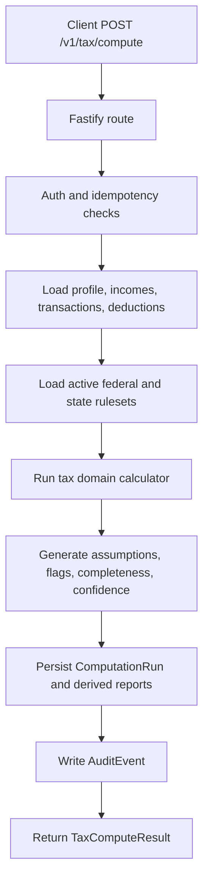
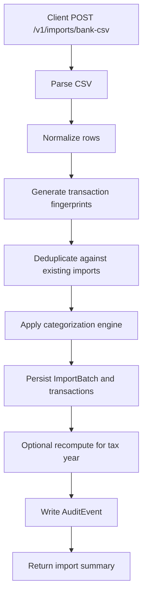
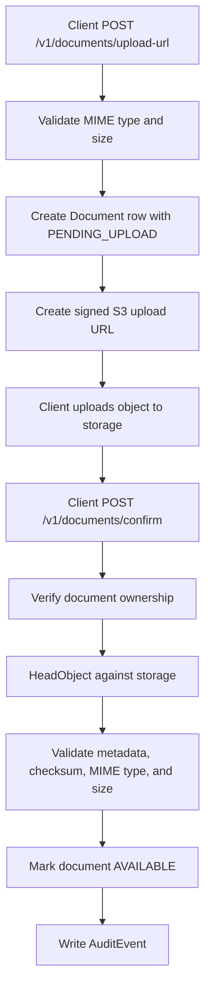

# fiscalND backend

`fiscalND` is a tax estimation backend for U.S. federal income tax and North Dakota individual income tax. It is designed for individual filers with `W-2`, `1099`, and straightforward `Schedule C` activity, and it keeps the core tax logic separate from HTTP, persistence, jobs, and ruleset data.

This document describes the repository as it exists today.

## Overview

The backend is built to answer five practical questions for a user and tax year:

- Is this case supported?
- What is the estimated federal and North Dakota tax liability?
- What information is still missing?
- How reliable is the estimate?
- How was the result calculated?

The primary output of the system is a persisted computation run with:

- federal tax
- North Dakota tax
- combined total
- explanation graph
- completeness score
- confidence score
- assumptions
- risk flags
- exact ruleset versions used for the run

## Current Scope

Supported:

- Annual tax profile per user
- Income sources: `W2`, `FORM_1099_MISC`, `FORM_1099_NEC`, `BUSINESS_GROSS`, `OTHER_TAXABLE`
- Manual transactions
- Bank CSV import with normalization, dedupe, and initial categorization
- Document upload using S3-compatible storage with short-lived signed URLs
- Tax categorization using rules, heuristics, and user overrides
- Federal tax calculation from a versioned IRS ruleset
- North Dakota 2026 state tax calculation from a versioned ND ruleset
- Standard deduction
- Basic itemized deduction input
- Scope detection
- Completeness scoring
- Confidence scoring
- Risk flags
- Explicit assumptions per run
- Audit events
- Workers for recompute, imports, exports, and ruleset checks

Partially supported:

- Basic `Schedule C`
  - business income and common expenses are supported
  - `self-employment tax` is calculated using the supported `Schedule SE` rules
  - the deduction for half of self-employment tax is applied
  - quarterly payment recommendations are generated when applicable
- `North Dakota sales tax`
  - the repository includes a starter local dataset for `Grand Forks`
  - period reporting is not implemented yet

Out of scope:

- Multi-state income tax allocation
- Advanced part-year residency handling
- Complex payroll
- Corporations
- `K-1`
- Complex `AMT`
- Advanced investments
- Advanced depreciation
- Electronic filing
- OCR extraction
- Production-grade KMS integration

## Tax Accuracy Status

### Federal 2026

The repository includes [`rulesets/IRS/2026.1.json`](rulesets/IRS/2026.1.json), which contains:

- 2026 standard deductions
- 2026 federal brackets by filing status
- federal ruleset metadata, checksum, and signature

### North Dakota 2026

The repository includes [`rulesets/ND/2026.2.json`](rulesets/ND/2026.2.json), which is currently the active North Dakota ruleset for tax year 2026.

That ruleset is based on:

- the `Form ND-1ES 2026` tax rate schedule
- the `North Dakota Income Tax Withholding Rates and Instructions 2026` booklet

The current implementation calculates the state tax schedule from those 2026 sources. Until the full `ND-1` 2026 instruction booklet is published and incorporated, the backend still relies on the 2025 instruction surface for additions, subtractions, and credits that are separately modeled.

### Local sales tax

The repository includes [`rulesets/ND/local/2026-01-01.csv`](rulesets/ND/local/2026-01-01.csv) with an initial local sales tax entry for `Grand Forks`.

## Execution Diagrams

### Tax compute request



### Bank CSV import



### Document upload



## Architecture

The codebase follows a small set of clear boundaries:

- [`src/app.ts`](src/app.ts): Fastify composition and route registration
- [`src/server.ts`](src/server.ts): HTTP bootstrap
- [`src/api`](src/api): auth helpers, validation, idempotency, OpenAPI
- [`src/services`](src/services): application services and persistence orchestration
- [`src/domain`](src/domain): tax calculation, categorization, completeness, confidence, scope, and ruleset loading
- [`src/infrastructure`](src/infrastructure): Prisma, Redis, S3, logger
- [`src/worker`](src/worker): BullMQ queues and handlers
- [`prisma/schema.prisma`](prisma/schema.prisma): relational schema
- [`rulesets`](rulesets): versioned tax datasets
- [`tests`](tests): domain tests and HTTP integration tests

Controller code does not calculate tax. The domain layer does.

## Repository Layout

```text
.
|-- prisma/
|   |-- schema.prisma
|   `-- seed.ts
|-- rulesets/
|   |-- meta.json
|   |-- IRS/
|   |   `-- 2026.1.json
|   `-- ND/
|       |-- 2026.1.json
|       |-- 2026.2.json
|       `-- local/
|           `-- 2026-01-01.csv
|-- src/
|   |-- api/
|   |   |-- auth.ts
|   |   |-- idempotency.ts
|   |   |-- openapi.ts
|   |   `-- schemas.ts
|   |-- config/
|   |   `-- env.ts
|   |-- domain/
|   |   |-- categorization/
|   |   |   |-- defaults.ts
|   |   |   `-- engine.ts
|   |   |-- rulesets/
|   |   |   |-- loader.ts
|   |   |   `-- types.ts
|   |   `-- tax/
|   |       |-- calculator.ts
|   |       |-- completeness.ts
|   |       |-- confidence.ts
|   |       |-- risk-flags.ts
|   |       |-- scope.ts
|   |       `-- types.ts
|   |-- infrastructure/
|   |   |-- logger.ts
|   |   |-- prisma.ts
|   |   |-- redis.ts
|   |   `-- s3.ts
|   |-- services/
|   |   |-- audit-service.ts
|   |   |-- auth-service.ts
|   |   |-- document-service.ts
|   |   |-- export-service.ts
|   |   |-- import-service.ts
|   |   `-- tax-service.ts
|   |-- shared/
|   |   |-- hash.ts
|   |   |-- ids.ts
|   |   `-- money.ts
|   |-- worker/
|   |   |-- handlers.ts
|   |   |-- index.ts
|   |   `-- queues.ts
|   |-- app.ts
|   `-- server.ts
|-- tests/
|   |-- fixtures/
|   |   `-- golden/
|   |       `-- simple-w2.expected.json
|   |-- http.integration.spec.ts
|   `-- tax-engine.spec.ts
|-- .env.example
|-- docker-compose.yml
|-- package.json
`-- tsconfig.json
```

## Stack

- `Node.js >= 22`
- `TypeScript`
- `Fastify`
- `Zod`
- `Prisma`
- `PostgreSQL`
- `BullMQ`
- `Redis`
- `Pino`
- `Vitest`
- S3-compatible object storage

## Platform Policies

### Idempotency

Critical create/compute endpoints require `Idempotency-Key`.

- Storage: `IdempotencyRecord` in PostgreSQL
- Key scope: `userId + method + route + idempotencyKey`
- Stored fields:
  - payload hash
  - status: `PROCESSING | COMPLETED | FAILED`
  - response code
  - serialized response body
  - `expiresAt`
- Current TTL: `7 days`

Behavior:

- same key + different payload -> `409 IDEMPOTENCY_CONFLICT`
- same key + completed response -> replay stored response
- same key + still processing -> `202 IDEMPOTENCY_IN_FLIGHT`

### Money and rounding

- Database storage currently uses `Decimal(12,2)`
- The domain does not use floating-point values as the canonical representation for tax amounts
- Amount normalization and rounding helpers live in [`src/shared/money.ts`](src/shared/money.ts)
- Rounding is applied at subtotal and total boundaries with `roundCurrency`

Known limitation:

- cent-level differences may appear compared with tools that round at different calculation stages

### Ruleset selection

- Rulesets are selected by `taxYear`
- [`rulesets/meta.json`](rulesets/meta.json) defines `activeByTaxYear`
- `effectiveFrom` is kept for traceability and future intra-year rule handling
- Each `ComputationRun` stores the exact ruleset versions used

### Error envelope

Every HTTP error follows:

```json
{
  "code": "VALIDATION_ERROR",
  "message": "Human-readable message",
  "details": {},
  "requestId": "opaque-request-id"
}
```

Stable error codes currently documented:

- `IDEMPOTENCY_CONFLICT`
- `IDEMPOTENCY_IN_FLIGHT`
- `RULESET_SIGNATURE_INVALID`
- `RULESET_STALE`
- `OUT_OF_SCOPE`

Expected status mapping:

- `400` -> `VALIDATION_ERROR`
- `401` -> `UNAUTHORIZED`
- `403` -> `FORBIDDEN`
- `404` -> `NOT_FOUND`
- `409` -> `IDEMPOTENCY_CONFLICT`
- `422` -> `UNPROCESSABLE_INPUT`
- `500` -> `INTERNAL_ERROR`
- `503` -> `SERVICE_UNAVAILABLE`

### Data deletion

The API does not yet expose a final user-data deletion endpoint. The intended flow is a controlled background job that:

- removes or purges operational records
- removes stored documents and storage references
- revokes sessions and refresh tokens
- anonymizes audit entries when deletion is not appropriate

Expected audit events for that flow:

- `USER_DATA_DELETION_REQUESTED`
- `USER_DATA_DELETION_COMPLETED`

## Data Model

The schema lives in [`prisma/schema.prisma`](prisma/schema.prisma).

Core entities:

- `User`
- `DeviceSession`
- `TaxYearProfile`
- `IncomeSource`
- `Document`
- `Transaction`
- `DeductionItem`
- `ComputationRun`
- `AuditEvent`

Tax intelligence entities:

- `TaxCategory`
- `CategoryMappingRule`
- `ComputationAssumption`
- `CompletenessReport`
- `ConfidenceReport`
- `ImportBatch`
- `TransactionFingerprint`
- `UserOverride`
- `RiskFlag`
- `ExportJob`
- `EstimatedPayment`
- `IdempotencyRecord`

Important design points:

- each computation run stores the exact federal and state ruleset versions
- totals, explanations, and input snapshots are persisted as JSON
- assumptions and risk flags are attached to runs, not only to users

## Rulesets and Data Governance

Relevant files:

- [`rulesets/meta.json`](rulesets/meta.json)
- [`rulesets/IRS/2026.1.json`](rulesets/IRS/2026.1.json)
- [`rulesets/ND/2026.2.json`](rulesets/ND/2026.2.json)
- [`rulesets/ND/local/2026-01-01.csv`](rulesets/ND/local/2026-01-01.csv)

Each ruleset keeps:

- `id`
- `effectiveFrom`
- `status`
- `source`
- `checksum`
- `validatedAt`
- `changelog`
- `rulesetSignature`
- `approvedBy`
- `approvedAt`
- `sourceHash`

Rulesets are immutable. A rule change creates a new ruleset version. Runtime loading is handled by [`src/domain/rulesets/loader.ts`](src/domain/rulesets/loader.ts), which:

- reads `meta.json`
- resolves the active ruleset for a tax year
- parses the JSON file
- verifies the HMAC signature

If signature verification fails, the loader raises `RULESET_SIGNATURE_INVALID`.

## Tax Domain

Key files:

- [`src/domain/tax/calculator.ts`](src/domain/tax/calculator.ts)
- [`src/domain/tax/completeness.ts`](src/domain/tax/completeness.ts)
- [`src/domain/tax/confidence.ts`](src/domain/tax/confidence.ts)
- [`src/domain/tax/risk-flags.ts`](src/domain/tax/risk-flags.ts)
- [`src/domain/tax/scope.ts`](src/domain/tax/scope.ts)
- [`src/domain/tax/types.ts`](src/domain/tax/types.ts)

The calculator pipeline is:

1. categorize uncategorized transactions
2. evaluate scope
3. calculate completeness
4. aggregate deductible expenses and deductions
5. aggregate income
6. choose standard or itemized deduction
7. calculate federal taxable income
8. apply federal brackets
9. calculate exact self-employment tax when supported
10. apply the deduction for half of self-employment tax
11. apply North Dakota tax brackets
12. generate assumptions and risk flags
13. calculate confidence
14. build the explanation graph

Current risk flags include:

- `HIGH_UNCATEGORIZED_RATIO`
- `MISSING_INCOME_SIGNAL`
- `UNUSUAL_MEALS_RATIO`
- `OUT_OF_SCOPE_CASE_DETECTED`
- `ESTIMATED_PAYMENTS_RECOMMENDED`
- `UNDERWITHHOLDING_RISK`

## API Response Contract

The tax compute response is the canonical output contract for clients.

Top-level fields:

- `runId`
- `computedAt`
- `rulesets`
- `estimateStatus`
- `scope`
- `federal`
- `state`
- `breakdown`
- `completeness`
- `confidence`
- `riskFlags`
- `assumptions`
- `explanation`

### `estimateStatus`

- `FULL`
- `PARTIAL`
- `BLOCKED`

`estimateStatus` governs whether combined totals are safe to display as final totals. If it is `BLOCKED`, the client must treat `breakdown.totalTax` and `breakdown.totalBalanceDue` as unavailable.

### Jurisdiction results

`federal.status`:

- `COMPUTED`
- `BLOCKED_INPUT`

`state.status`:

- `COMPUTED`
- `BLOCKED_RULESET`
- `OUT_OF_SCOPE`

### Ruleset metadata

The public response shape for `rulesets` is:

```ts
type RulesetMeta = {
  id: string;
  effectiveFrom: string;
  status: "active" | "stale" | "deprecated";
  checksum: string;
  validatedAt: string | null;
  computable?: boolean;
};
```

### Explanation graph

The public explanation contract is a graph keyed by node id:

```ts
type ExplanationNode = {
  id: string;
  label: string;
  formula: string | null;
  inputs: Record<string, number | string | null>;
  outputs: Record<string, number | string | null>;
  childrenIds: string[];
  transactionRefs: string[];
};

type ExplanationGraph = {
  rootNodeId: string;
  nodesById: Record<string, ExplanationNode>;
};
```

This shape is intended for drill-down UIs and avoids duplicating repeated nodes in the payload.

## Services

### Auth

[`src/services/auth-service.ts`](src/services/auth-service.ts)

- register
- login
- refresh token rotation
- device sessions
- MFA endpoints are defined, but the provider is not configured yet

### Tax

[`src/services/tax-service.ts`](src/services/tax-service.ts)

- load user tax context
- load active rulesets
- call the domain calculator
- persist computation runs
- persist assumptions and risk flags
- update completeness and confidence reports
- serve summary, explanation, confidence, assumptions, and risk endpoints

### Documents

[`src/services/document-service.ts`](src/services/document-service.ts)

- create signed upload URLs
- confirm uploads using ownership and storage metadata checks
- list documents
- serve short-lived signed download URLs

### Imports

[`src/services/import-service.ts`](src/services/import-service.ts)

- parse bank CSV files
- normalize columns
- generate transaction fingerprints
- deduplicate rows
- categorize imported transactions
- persist import summaries

### Exports

[`src/services/export-service.ts`](src/services/export-service.ts)

- create tax pack exports
- generate downloadable PDF artifacts
- persist export jobs

### Audit

[`src/services/audit-service.ts`](src/services/audit-service.ts)

- write structured audit events for auth, tax, document, import, and export operations

## HTTP API

The HTTP surface is defined in [`src/app.ts`](src/app.ts). The OpenAPI document is generated by [`src/api/openapi.ts`](src/api/openapi.ts) and served at `GET /openapi.json`.

Registered Fastify plugins:

- `@fastify/sensible`
- `@fastify/rate-limit`
- `@fastify/multipart`
- `@fastify/jwt`

Middleware:

- auth guard in [`src/api/auth.ts`](src/api/auth.ts)
- request validation in [`src/api/schemas.ts`](src/api/schemas.ts)
- idempotency in [`src/api/idempotency.ts`](src/api/idempotency.ts)

Versioned endpoints:

- `POST /v1/auth/register`
- `POST /v1/auth/login`
- `POST /v1/auth/refresh`
- `POST /v1/auth/mfa/enable`
- `POST /v1/auth/mfa/verify`
- `GET /v1/tax/profile?year=2026`
- `PUT /v1/tax/profile?year=2026`
- `POST /v1/incomes`
- `GET /v1/incomes?year=2026`
- `PUT /v1/incomes/:id`
- `POST /v1/transactions`
- `GET /v1/transactions?year=2026&from=&to=&category=&page=&pageSize=`
- `PUT /v1/transactions/:id`
- `POST /v1/transactions/:id/link-document`
- `POST /v1/documents/upload-url`
- `POST /v1/documents/confirm`
- `GET /v1/documents`
- `GET /v1/documents/:id`
- `POST /v1/imports/bank-csv`
- `GET /v1/review/low-confidence?year=2026`
- `GET /v1/review/uncategorized?year=2026`
- `POST /v1/review/confirm-category`
- `POST /v1/tax/compute?year=2026`
- `GET /v1/tax/summary?year=2026`
- `GET /v1/tax/explain?runId=...`
- `GET /v1/tax/completeness?year=2026`
- `GET /v1/tax/confidence?runId=...`
- `GET /v1/tax/risk-flags?runId=...`
- `GET /v1/tax/assumptions?runId=...`
- `POST /v1/exports/tax-pack?year=2026`
- `GET /v1/exports/:id/download`
- `GET /v1/health`

Endpoints that require `Idempotency-Key`:

- `POST /v1/incomes`
- `POST /v1/transactions`
- `POST /v1/documents/confirm`
- `POST /v1/tax/compute`

## Workers

Worker files:

- [`src/worker/queues.ts`](src/worker/queues.ts)
- [`src/worker/handlers.ts`](src/worker/handlers.ts)
- [`src/worker/index.ts`](src/worker/index.ts)

Declared queues:

- `extract_document`
- `import_bank_csv`
- `recompute_tax_year`
- `generate_tax_pack_pdf`
- `ruleset_update_check`
- `rebuild_category_index`
- `purge_expired_upload_urls`
- `dead_letter_reprocess`

Current status:

- `recompute_tax_year` is functional and reuses `computeTaxYear`
- `ruleset_update_check` is functional and scans the ruleset metadata for stale entries
- the remaining handlers are registered and ready for provider-specific implementations

## Security Posture

Implemented:

- JWT access tokens
- refresh token rotation
- device sessions
- rate limiting
- audit events
- ownership checks on user-scoped resources
- S3-compatible signed upload and download URLs
- storage-side validation during document confirmation

Prepared but not complete:

- MFA endpoints
- KMS-backed encryption
- production bucket hardening

Not implemented yet:

- advanced RBAC
- field-level encryption
- WAF
- DLP
- automated backup retention policy
- distributed tracing

### Sensitive data policy

The current system is not intended to store:

- full SSNs
- full bank account numbers
- financial institution credentials

The current system does store:

- amounts
- merchant names
- document metadata
- storage object references
- tax profile fields
- withholding values entered by the user

Target retention remains configurable, with long-term tax history expected to be retained for approximately `7 years`.

## Environment Variables

The environment contract is defined in [`src/config/env.ts`](src/config/env.ts) and mirrored in [`.env.example`](.env.example).

Important variables:

- `NODE_ENV`
- `PORT`
- `HOST`
- `DATABASE_URL`
- `REDIS_URL`
- `CORS_ORIGINS`
- `JWT_ACCESS_SECRET`
- `JWT_REFRESH_SECRET`
- `JWT_ACCESS_TTL`
- `JWT_REFRESH_TTL`
- `S3_BUCKET`
- `S3_REGION`
- `S3_ENDPOINT`
- `S3_ACCESS_KEY`
- `S3_SECRET_KEY`
- `S3_FORCE_PATH_STYLE`
- `S3_SIGNED_UPLOAD_TTL_SECONDS`
- `S3_SIGNED_DOWNLOAD_TTL_SECONDS`
- `DOCUMENT_MAX_SIZE_BYTES`
- `DOCUMENT_ALLOWED_MIME_TYPES`
- `KMS_KEY_ID`
- `DEFAULT_RULESET_IRS`
- `DEFAULT_RULESET_ND`
- `RULESET_SIGNING_SECRET`

Development defaults exist in `env.ts`. Production environments should override all secrets and storage settings explicitly.

On Render, `S3_ENDPOINT` must point to the public URL of the storage service because document uploads use presigned URLs that the client must reach directly.

For browser clients, `CORS_ORIGINS` must include the exact frontend origin, for example `https://your-frontend.onrender.com`.

## Local Development

Requirements:

- Node.js 22+
- PostgreSQL
- Redis
- S3-compatible storage

Setup:

```bash
npm.cmd run infra:up
npm.cmd install
copy .env.example .env
npm.cmd run prisma:generate
npm.cmd run prisma:push
npm.cmd run prisma:seed
```

Development:

```bash
npm.cmd run dev
npm.cmd run dev:worker
```

Build and run:

```bash
npm.cmd run build
npm.cmd run start
npm.cmd run start:worker
```

Local infrastructure:

- [`docker-compose.yml`](docker-compose.yml) starts PostgreSQL 16, Redis 7, and MinIO
- [`prisma/seed.ts`](prisma/seed.ts) seeds `TaxCategory` and `CategoryMappingRule`

## Deploy On Render

The repository includes [`render.yaml`](render.yaml), which provisions:

- one Node web service for the API
- one Node background worker
- one managed PostgreSQL database
- one managed Redis instance
- one public MinIO service with a persistent disk for S3-compatible object storage

The API service runs:

- `npm ci && npm run build` during build
- `npm run render:predeploy` before deploy
- `npm run start` at runtime

The predeploy step runs the committed Prisma migrations and reseeds the baseline tax categories:

```bash
npm run prisma:migrate:deploy
npm run prisma:seed
```

The worker uses the same build artifact and starts with:

```bash
npm run start:worker
```

Render-specific notes:

- the API health check is `GET /health`
- MinIO is exposed as a public web service because the backend returns presigned upload and download URLs to clients
- PDF tax-pack exports now use object storage when S3 is configured, so they no longer depend on the web service filesystem
- if `S3_ENDPOINT` is empty, the backend still boots, but document upload/download endpoints return `503` and exports fall back to local disk

First deploy flow:

1. Create the stack from [`render.yaml`](render.yaml).
2. Wait for the `fiscalnd-storage` service to receive its public `.onrender.com` URL.
3. In the `fiscalnd-api` service, set `S3_ENDPOINT` to that public MinIO URL, for example `https://fiscalnd-storage.onrender.com`.
4. Redeploy `fiscalnd-api`. The worker inherits the same `S3_ENDPOINT` value from the API service.

If you prefer AWS S3, Cloudflare R2, or another external S3-compatible provider, keep the API and worker services and replace the MinIO-specific S3 variables with that provider's endpoint, bucket, region, and credentials.

## Frontend Integration

The deployed API base URL is the Render web service URL plus `/v1`.

Example:

```text
https://fiscalnd-api.onrender.com/v1
```

Browser clients must be allowed in `CORS_ORIGINS`.

Example Render value:

```text
CORS_ORIGINS=https://your-frontend.onrender.com,http://localhost:3000,http://localhost:5173
```

Frontend requests should follow these rules:

- send `Authorization: Bearer <accessToken>` on protected routes
- send `Content-Type: application/json` for JSON requests
- send `Idempotency-Key: <unique-value>` on `POST /incomes`, `POST /transactions`, `POST /documents/confirm`, and `POST /tax/compute`
- call `POST /v1/auth/login` or `POST /v1/auth/register` first and persist the returned tokens client-side

## Testing

Test files:

- [`tests/tax-engine.spec.ts`](tests/tax-engine.spec.ts)
- [`tests/http.integration.spec.ts`](tests/http.integration.spec.ts)

Current coverage includes:

- simple `W-2` case with standard deduction
- self-employed case with exact self-employment tax
- blocking behavior when required profile data is missing
- HTTP bank CSV import flow
- HTTP tax pack export and download flow

Golden fixture:

- [`tests/fixtures/golden/simple-w2.expected.json`](tests/fixtures/golden/simple-w2.expected.json)

Verified commands:

```bash
npm.cmd run prisma:generate
npm.cmd run lint
npm.cmd run test
npm.cmd run build
```

Notes:

- `tests/http.integration.spec.ts` skips automatically when PostgreSQL is not available on `localhost:5432`
- in this environment those HTTP tests are skipped unless the local stack is running

## Limitations

- OCR extraction is not implemented
- recurring worker scheduling is not configured yet
- there is no internal admin dashboard
- HTTP integration tests depend on local infrastructure

## Near-Term Work

- add the initial Prisma migration
- expand HTTP integration coverage
- add reproducibility tests
- add idempotency replay and conflict tests
- add ruleset signature verification tests
- implement OCR and document scanning
- harden production storage policies

## Tax Sources

Primary sources reflected in the current rulesets:

- IRS Rev. Proc. 2025-32
  - https://www.irs.gov/irb/2025-43_IRB#REV-PROC-2025-32
- IRS federal income tax rates and brackets
  - https://www.irs.gov/filing/federal-income-tax-rates-and-brackets
- North Dakota Office of State Tax Commissioner forms hub
  - https://www.tax.nd.gov/tax-forms/individual-income-tax-forms-instructions
- North Dakota local sales/use tax reference
  - https://www.tax.nd.gov/business/sales-use-gross-receipts-tax/local-sales-use-tax-cities-and-counties/maximum-purchases-tax-city-county

Local archival source documents used to derive the active North Dakota ruleset include:

- `Form ND-1ES 2026`
- `North Dakota Income Tax Withholding Rates and Instructions 2026`
- `2025 North Dakota individual income tax booklet` for temporary reference on additions, subtractions, and credits until the 2026 booklet is incorporated

## Summary

This repository already includes:

- a versioned tax ruleset system
- a tested tax calculation domain
- explainable computation output
- completeness, confidence, assumptions, and risk flags
- a usable HTTP API
- CSV import
- signed document upload/download flows
- PDF export
- audit logging
- a Render blueprint for API, worker, database, Redis, and object storage

The main remaining product work is around OCR, deeper operational hardening, broader integration coverage, and production infrastructure policies.
